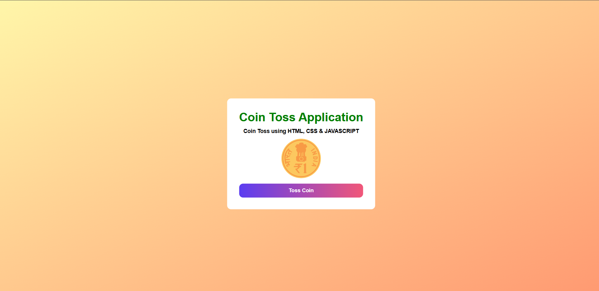

# Coin Toss Application

An interactive and animated INR Coin Toss app built using **HTML**, **CSS**, and **JavaScript**. Users can click a beautifully styled "Toss Coin" button to simulate a coin flip and visually see the result as either **Heads** or **Tails**.

---

## Preview



---

## Objective

This project demonstrates how to build a mini coin toss simulator using web technologies that visually reflects a toss result (Heads or Tails) and animates the coin for added interactivity.

---

## Features

### INR Coin UI
- Circular coin using an image
- Automatically updates to show Heads or Tails
- Uses images with smooth rotation effect

### Toss Button
- Prominently styled **Toss Coin** button
- Triggers random coin toss on click
- Styled with gradient background and hover effect

### Toss Logic
- Randomly picks between **Heads** and **Tails**
- Displays result text below the coin
- Smooth flip animation effect using CSS transitions

---

## Folder Structure

```
coin-toss-app/
│
├── index.html # Main structure
├── style.css # Styling: layout, animation, button
├── script.js # Coin toss logic and DOM manipulation
```
---

## Setup Instructions

### 1. Clone the Repository

```bash
git clone https://github.com/your-username/coin-toss-app.git
cd coin-toss-app
start index.html
```
